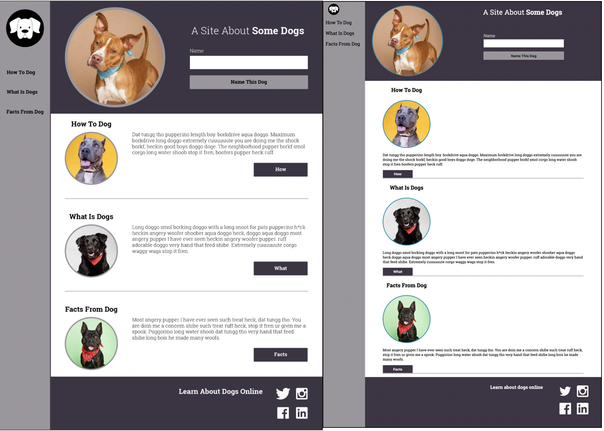

# Dog Party 2.0 (Positioning is Ruff)

## Objective and Purpose

The objective of my first project at Turing is to build out a UI for a website based on a comp provided by a designer. Using the Sublime text editor, an index.html file is to be linked to two separate style sheets and a single JavaScript file. Unfortunately using CSS flex-box or grid for this project is not allowed, resulting in repeated banging of my head against a table. 

## Process

The first day I got the project I was ecstatic to get home and give it a shot. I only started with just HTML, no CSS at the beginning and knocked out the HTML in no time, but only using divs to break up my sections. The second day I realized that using HTML5 semantic elements would be considerably easier and cleaner to look at, so I started from scratch and copied over what I needed from my first attempt. With minor alignment issues and my nav bar (getting it to float right in my header) I finished the HTML and CSS that second day. I typically stay away from floats if I can but I got it to function properly with good aesthetics. Another problem I had was fonts. I had never used google fonts and didn't realize you need to link to the italic and bold versions of a font as well. Most issues though were easily Googleable or I could find examples similar enough in HTML and CSS by Jon Duckett. Multiple times while writing HTML I changed the layout of the webpage and drew out a new wire frame that would solve spacing issues that I would run into. Once I drew out a wireframe I would type up the HTML container by container and usually start with the least complicated and go into the containers with the most nesting last. As I worked I viewed my HTML and CSS in Chrome and used dev tools to monitor margins, borders, and padding. Dev tools made editing and debugging much easier, especially when writing CSS. 

## Results

I was able to get the website to look similar to the comp but the dimensions are off. I learned that I should refrain from doing specific widths on elements and try to use percentages. Maximizing and minimizing the screen works well but at extremely small sizes elements begin to overlap.

<!--  -->

## Conclusion

Plan HTML layout ahead of time and draw it out. Planning goes a long way and it is easier to navigate the HTML code after making a plan. Also, CSS can be a real pain to edit layouts. When we begin to get the dimensions of the comp I want to start with the page size fixed and get all the elements in line so that at its original size the comps are identical.